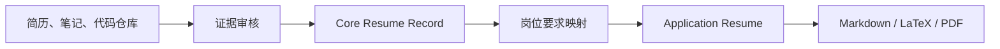

<div align="center">

# ResumeDom

**建立一份真实职业记录，为每次投递精准定制，绝不虚构证据。**

[](resume-reviewer/SKILL.md)
[](#两种简历模式)
[](#可编辑-latex-输出)
[](#功能矩阵)

[English](README.md) · **简体中文**

</div>

ResumeDom 是面向美国科技岗位、以事实证据为核心的 Codex 简历 skill。它可以评估、修改、定制并生成基于证据的美国科技简历。

> 一份职业事实来源，为每个岗位生成一份聚焦的投递简历。

**[快速开始](#快速开始) · [工作流程](#工作流程) · [功能矩阵](#功能矩阵) · [简历模式](#两种简历模式) · [LaTeX](#可编辑-latex-输出) · [规则](#项目专属规则)**

## Star History

<a href="https://www.star-history.com/?repos=weeelin98%2Fresumedom&type=date&legend=top-left">
 <picture>
   <source media="(prefers-color-scheme: dark)" srcset="https://api.star-history.com/chart?repos=weeelin98/resumedom&type=date&theme=dark&legend=top-left" />
   <source media="(prefers-color-scheme: light)" srcset="https://api.star-history.com/chart?repos=weeelin98/resumedom&type=date&legend=top-left" />
   
 </picture>
</a>

## 快速开始

让 Codex 直接从 GitHub 安装：

```text
Use $skill-installer to install https://github.com/weeelin98/ResumeDom/tree/main/resume-reviewer
```

安装后可以从以下任一提示开始：

```text
Use $resume-reviewer to assess this resume without rewriting it yet.
```

```text
Use $resume-reviewer to build a verified Core Resume Record from my resume, notes, and repositories.
```

```text
Use $resume-reviewer to tailor my Core Resume Record to this job description and return editable LaTeX.
```

安装完成后，skill 将从下一轮 Codex 对话开始可用。

<details>
<summary><strong>其他安装方式</strong></summary>

### 内置安装脚本

```bash
python3 "${CODEX_HOME:-$HOME/.codex}/skills/.system/skill-installer/scripts/install-skill-from-github.py" \
  --repo weeelin98/ResumeDom \
  --path resume-reviewer
```

安装位置为 `${CODEX_HOME:-$HOME/.codex}/skills/resume-reviewer`。如果目标目录已经存在，需要先移动或删除旧版本。

### 链接本地开发仓库

希望执行 `git pull` 后直接使用最新版本时，可以创建符号链接：

```bash
git clone https://github.com/weeelin98/ResumeDom.git
ln -s "$(pwd)/ResumeDom/resume-reviewer" "${CODEX_HOME:-$HOME/.codex}/skills/resume-reviewer"
```

仅在目标路径不存在时创建链接。安装或更新后，请开启新一轮 Codex 对话。

</details>

## 工作流程



Core Resume Record 始终作为职业事实来源。每份 Application Resume 都是针对一个岗位的独立内容选择，不得反向改写事实记录。

## 功能矩阵

| # | 功能 | 输出结果 |
|---:|---|---|
| 1 | **简历评估** | 诊断 ATS 可读性、证据质量、岗位相关性、表达、可信度、隐私和版式，不假装能够预测客观 ATS 分数。 |
| 2 | **简历修改** | 在不改变事实的前提下优化 bullet、技术表达、时态和 section 结构。 |
| 3 | **Core Resume Record 生成** | 将简历、笔记、代码仓库和候选人回答整理为 `VERIFIED`、`NEEDS CONFIRMATION` 和 `DO NOT USE` 证据。 |
| 4 | **Application Resume 生成** | 为一次具体投递选择最强的已验证证据，生成简洁倒序简历。 |
| 5 | **根据职位描述定制** | 将岗位要求与候选人证据映射为 `DIRECT`、`ADJACENT` 或 `GAP`。 |
| 6 | **岗位能力映射** | 支持 Frontend、Backend、Full-Stack、AI/ML、Data、Cloud/DevOps/SRE、Mobile、Product 和 Project/Program 方向。 |
| 7 | **可信度保护** | 阻止虚构职位、日期、技术、指标、用户、ownership、部署和业务结果。 |
| 8 | **自动验证** | 检查 Skills 位置、英文冠词、禁用动词、第一人称、空话、占位符、bullet 长度和重复开头动词。 |
| 9 | **可编辑 LaTeX 生成** | 生成可复用 `.tex` 源文件；环境支持时同时提供 PDF 预览。 |

## 两种简历模式

| | Core Resume Record | Application Resume |
|---|---|---|
| **目的** | 保存完整、真实的职业证据 | 为一个具体岗位争取面试机会 |
| **读者** | 候选人和简历 agent | Recruiter、Hiring Manager 和 ATS |
| **范围** | 所有相关且已验证的历史，加上未确认问题 | 只保留与岗位最相关的已验证证据 |
| **长度** | 不受一页限制 | 实习生和应届毕业生通常保持一页 |
| **状态** | `Not for Submission` | 通过最终审核后可投递 |
| **关系** | 不变的职业事实来源 | 派生输出，不得改变 Core 事实 |

### Application Resume 默认格式

- 不使用 Summary。
- 不列 Coursework。
- 学校/公司左对齐，城市右对齐。
- 学位/官方职位位于第二行，日期右对齐。
- 每段 Experience 固定 3 条 bullet。
- 项目根据真实证据保留 2–4 条 bullet。
- Skills 必须位于最后。

## 项目专属规则

以下仓库规则会有意覆盖通用简历惯例：

| 规则 | 执行方式 |
|---|---|
| Skills 位置 | `Skills` 必须位于简历最后。 |
| 英文冠词 | 删除简历正文中所有独立的 `a`、`an` 和 `the`。 |
| 禁用动词 | 最终简历不得使用 `led`、`managed` 或 `architected`。 |
| 时态 | 经历和项目 bullet 使用过去时。 |
| 事实证据 | 不得虚构指标、技术、日期、ownership、部署或业务结果。 |
| 指标 | 真实指标不设置人为百分比上限；必要时补充基线、周期或范围。 |

## 可编辑 LaTeX 输出

模板：[`resume-reviewer/assets/latex/application-resume.tex`](resume-reviewer/assets/latex/application-resume.tex)

模板采用 ATS 友好的单栏结构、一行联系方式和可复用简历宏；系统安装 Times New Roman 时使用该字体，否则回退为 TeX Gyre Termes。

```bash
cp resume-reviewer/assets/latex/application-resume.tex application-resume.tex
xelatex application-resume.tex
```

也可以使用 Tectonic：

```bash
tectonic -X compile application-resume.tex
```

填写个人信息前必须先复制模板，仓库中的模板应始终保持通用。

## 验证 Markdown 简历

```bash
python3 resume-reviewer/scripts/validate_resume.py path/to/resume.md
```

验证器只能辅助人工审核，不能证明事实真实性。

<details>
<summary><strong>仓库结构</strong></summary>

```text
resume-reviewer/
├── SKILL.md
├── agents/openai.yaml
├── assets/
│   └── latex/application-resume.tex
├── references/
│   ├── ats-and-layout.md
│   ├── evidence-and-car.md
│   ├── output-schema.md
│   ├── resume-templates.md
│   └── role-competencies.md
└── scripts/validate_resume.py
```

`resumeReviewer.json` 作为兼容入口保留，供无法直接加载 Codex skill 的工具使用。

</details>

## 参考文献

### 简历方法

- Laura DeCarlo，《*Resumes For Dummies*》，第 9 版，John Wiley & Sons，2026。主要参考 ATS、倒序格式、Core/OnTarget Resume、CAR 证据、AI 防幻觉、简历语言、新毕业生策略和最终审校相关章节。
- [OpenAI Developers：Codex use cases — Save workflows as skills](https://developers.openai.com/codex/use-cases)，用于 Codex skill 目录结构与使用方式参考。


本仓库不重新分发参考书 PDF。任何简历方法都不能保证 ATS 排名、面试或录用结果。
